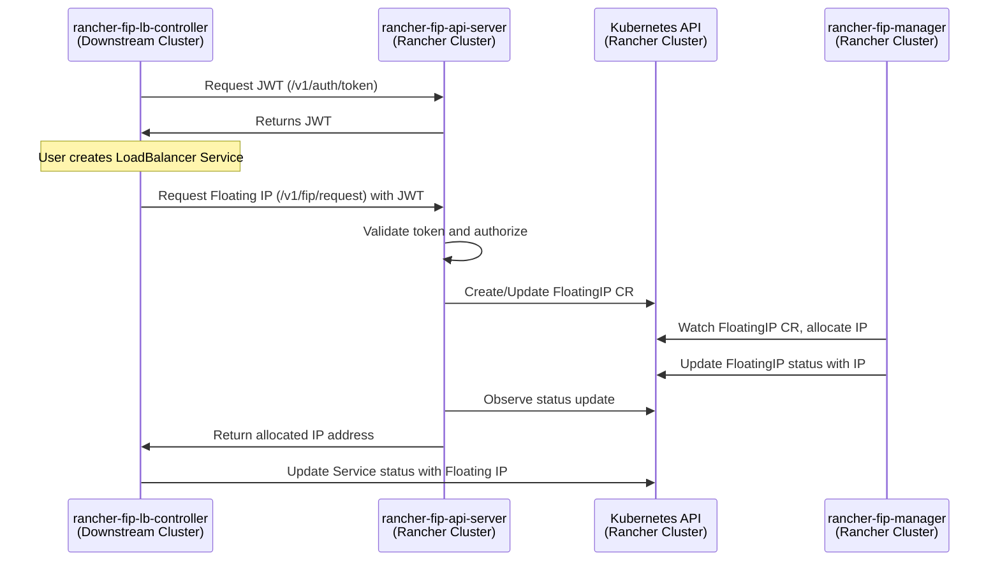

# rancher-fip-api-server

The `rancher-fip-api-server` (Rancher Floating IP API Server) runs in the Rancher management cluster and acts as a bridge between downstream Kubernetes clusters and the `rancher-fip-manager`. It exposes a REST API that the `rancher-fip-lb-controller` (client) in downstream clusters uses to request, release, list, and delete Floating IPs.

## High-Level Architecture

The system is composed of three components:

1.  **rancher-fip-api-server**: Runs in the Rancher management cluster. It handles JWT-based authentication, authorization against project-scoped Secrets, and Floating IP requests.
2.  **rancher-fip-lb-controller**: A controller running in downstream clusters. It monitors `LoadBalancer` Services and talks to the API server to request floating IPs.
3.  **rancher-fip-manager**: A Kubernetes operator that manages `FloatingIP` custom resources and integrates with IPAM/cloud providers to allocate/assign IPs.



## Features

- **REST API**: Request, release, list, and delete Floating IPs
- **Authentication**: JWT (RS256) issued by the API server
- **Authorization**: Project-scoped `rancher-fip-config-<project>` Secrets
- **Kubernetes-native**: Interacts with `FloatingIP` CRDs and Rancher `Project`s
- **Leader election**: High availability via LeaseLock
- **Rate limiting**: Configurable RPS and burst
- **TLS support**: Optional HTTPS with provided TLS Secret

## API

The server exposes the following endpoints (as implemented in code):

- `POST /v1/auth/token`: Generate a JWT token.
- `POST /v1/fip/request`: Request a new Floating IP for a Service.
- `POST /v1/fip/release`: Release a Floating IP assignment.
- `DELETE /v1/fip/delete`: Delete a Floating IP record by IP address.
- `POST /v1/fip/list`: List Floating IPs for a project.

### Request/Response Details

- `POST /v1/auth/token`
  - Request: `{ "clientID": "a-unique-client-identifier" }`
  - Response: `{ "token": "<JWT>", "expires_at": "<RFC3339>" }`

- `POST /v1/fip/request` (Authorization: `Bearer <JWT>`)
  - Request:
    ```json
    {
      "clientsecret": "<from k8s secret>",
      "cluster": "<cluster-id>",
      "project": "<project-name>",
      "floatingippool": "<pool>",
      "servicenamespace": "<namespace>",
      "servicename": "<service>",
      "ipaddr": "<optional-specific-ip>"
    }
    ```
  - Response: `{ "status": "approved", "cluster": "...", "project": "...", "floatingippool": "...", "servicenamespace": "...", "servicename": "...", "ipaddr": "<allocated-ip>", "subnet": "<subnet>" }`

- `POST /v1/fip/release` (Authorization: `Bearer <JWT>`)
  - Request:
    ```json
    {
      "clientsecret": "<from k8s secret>",
      "cluster": "<cluster-id>",
      "project": "<project-name>",
      "floatingippool": "<pool>",
      "servicenamespace": "<namespace>",
      "servicename": "<service>",
      "ipaddr": "<ip-to-release>"
    }
    ```
  - Response: `{ "status": "released", "message": "Floating IP released successfully" }`

- `POST /v1/fip/list` (Authorization: `Bearer <JWT>`)
  - Request:
    ```json
    {
      "clientsecret": "<from k8s secret>",
      "cluster": "<cluster-id>",
      "project": "<project-name>",
      "floatingippool": "<pool>"
    }
    ```
  - Response: `{ "clientsecret": "...", "cluster": "...", "project": "...", "floatingips": [ { "project": "...", "cluster": "...", "floatingippool": "...", "servicenamespace": "...", "servicename": "...", "ipaddr": "1.2.3.4" } ] }`

- `DELETE /v1/fip/delete` (Authorization: `Bearer <JWT>`)
  - Request:
    ```json
    {
      "clientsecret": "<from k8s secret>",
      "project": "<project-name>",
      "ipaddr": "<ip-to-delete>"
    }
    ```
  - Response: `{ "status": "deleted", "message": "Floating IP deleted successfully" }`

## Deployment and Usage

### Prerequisites

- A Kubernetes cluster
- `kubectl` configured for the cluster
- Optionally Helm (not required by default manifests)

### Install

1. Create the `rancher-fip-manager` namespace:
   ```sh
   kubectl create namespace rancher-fip-manager
   ```

2. Optional: pre-create the JWT private key Secret (otherwise it will be generated):
   ```sh
   # Generate RSA private key
   openssl genrsa -out private.key 2048

   # Create the secret
   kubectl create secret generic jwt-private-key \
     --from-file=key=./private.key -n rancher-fip-manager

   # Clean up local key file
   rm private.key
   ```

3. Create TLS Secret if you want HTTPS (recommended):
   ```sh
   kubectl create secret tls rancher-fip-api-server-tls \
     --cert=path/to/tls.crt \
     --key=path/to/tls.key \
     -n rancher-fip-manager
   ```

4. Deploy manifests:
   ```sh
   kubectl apply -f deployments/deployment.yaml
   ```

### Configuration (flags)

Defaults are defined in `cmd/api-server/main.go` and surfaced in the manifest.

| Flag | Description | Default |
| ---- | ----------- | ------- |
| `--kubeconfig` | Path to kubeconfig file | env `KUBECONFIG` or in-cluster |
| `--kubecontext` | Kubeconfig context to use | env `KUBECONTEXT` |
| `--leader-elect` | Enable leader election | `true` |
| `--lease-lock-name` | Leader election lock name | `rancher-fip-api-server-lock` |
| `--lease-lock-namespace` | Leader election lock namespace | `rancher-fip-manager` |
| `--jwt-generate-key` | Generate JWT key if missing | `true` |
| `--jwt-secret-name` | Secret name for JWT private key | `jwt-private-key` |
| `--jwt-secret-namespace` | Namespace for JWT secret | `rancher-fip-manager` |
| `--rate-limit-per-second` | Requests per second | `10` |
| `--rate-limit-burst` | Burst size | `20` |
| `--listen-address` | Server listen address | `:8080` (manifest sets `:8443` with TLS) |
| `--tls-enabled` | Enable TLS (HTTPS) | `false` (manifest sets `true`) |
| `--tls-cert-file` | TLS certificate path | `""` (manifest mounts `/etc/tls/tls.crt`) |
| `--tls-key-file` | TLS key path | `""` (manifest mounts `/etc/tls/tls.key`) |

### Create client authorization Secret

For each authorized Rancher project, create a Secret named `rancher-fip-config-<project>` in the Rancher project namespace:

```sh
kubectl create secret generic rancher-fip-config-<project> \
  --from-literal=project=<project> \
  --from-literal=clientSecret=<your-client-secret> \
  -n <project-namespace>
```

### Test with curl (via port-forward)

1) Port-forward the Service (when TLS enabled in manifests):

```sh
kubectl port-forward svc/rancher-fip-api-server 8443:8443 -n rancher-fip-manager
```

2) Get a JWT token:

```sh
TOKEN_RESPONSE=$(curl -sk -X POST https://localhost:8443/v1/auth/token \
  -H "Content-Type: application/json" \
  -d '{"clientID":"my-test-client"}')
TOKEN=$(echo "$TOKEN_RESPONSE" | jq -r .token)
```

3) Request a Floating IP:

```sh
curl -sk -X POST https://localhost:8443/v1/fip/request \
  -H "Content-Type: application/json" \
  -H "Authorization: Bearer $TOKEN" \
  -d '{
    "clientsecret": "<your-client-secret>",
    "cluster": "c-m-abcde",
    "project": "<your-project>",
    "floatingippool": "public-net",
    "servicenamespace": "my-namespace",
    "servicename": "my-service",
    "ipaddr": "1.2.3.4"
  }'
```

4) Release a Floating IP assignment:

```sh
curl -sk -X POST https://localhost:8443/v1/fip/release \
  -H "Content-Type: application/json" \
  -H "Authorization: Bearer $TOKEN" \
  -d '{
    "clientsecret": "<your-client-secret>",
    "cluster": "c-m-abcde",
    "project": "<your-project>",
    "floatingippool": "public-net",
    "servicenamespace": "my-namespace",
    "servicename": "my-service",
    "ipaddr": "1.2.3.4"
  }'
```

5) List Floating IPs for a project:

```sh
curl -sk -X POST https://localhost:8443/v1/fip/list \
  -H "Content-Type: application/json" \
  -H "Authorization: Bearer $TOKEN" \
  -d '{
    "clientsecret": "<your-client-secret>",
    "cluster": "c-m-abcde",
    "project": "<your-project>",
    "floatingippool": "public-net"
  }'
```

6) Delete a Floating IP record by IP:

```sh
curl -sk -X DELETE https://localhost:8443/v1/fip/delete \
  -H "Content-Type: application/json" \
  -H "Authorization: Bearer $TOKEN" \
  -d '{
    "clientsecret": "<your-client-secret>",
    "project": "<your-project>",
    "ipaddr": "1.2.3.4"
  }'
```

## License

Copyright (c) 2026 Joey Loman <joey@binbash.org>

Licensed under the Apache License, Version 2.0 (the "License");
you may not use this file except in compliance with the License.
You may obtain a copy of the License at

[http://www.apache.org/licenses/LICENSE-2.0](http://www.apache.org/licenses/LICENSE-2.0)

Unless required by applicable law or agreed to in writing, software
distributed under the License is distributed on an "AS IS" BASIS,
WITHOUT WARRANTIES OR CONDITIONS OF ANY KIND, either express or implied.
See the License for the specific language governing permissions and
limitations under the License.
